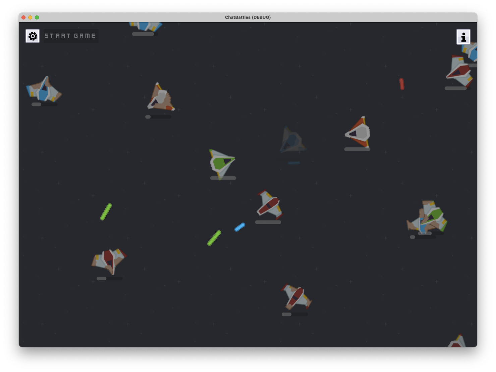

# ChatBattles

A silly game I made in a weekend.

## Playing the Game

1. Connect to the channel's chat using the settings menu (gear icon in the top left).
2. Start a game.
3. Get chatters to join the game by typing `!join` or `join` in chat.
   1. Currently there is a max of 20 players.
   2. You can also click anywhere in the background to add fake players.
4. Wait for the timer to finish, the game will start automatically.
5. Repeat from #2 when the battle is finished.

## Development

> [!NOTE]
> When developing in VSCode, use the [vscode-swift](https://github.com/swiftlang/vscode-swift) extension.

1. Build once with `swift build -c debug`.
2. Link the dylibs:
	- ``ln -s `pwd`/.build/debug/libSwiftGodot.dylib godot/bin/libSwiftGodot.dylib``
	- ``ln -s `pwd`/.build/debug/libChatBattles.dylib godot/bin/libChatBattles.dylib``
3. Open the project from Godot once so it loads the extension.
4. Run the game.
	- With VSCode: Run the `Debug ChatBattles` launch configuration.
5. Debug in VSCode
	- Run the `Debug ChatBattles` launch configuration.
	- Run the game from Godot and use the `Attach to PID` launch configuration.
6. Debug in Godot:
	- Build the Swift library (with CLI or VSCode).
	- Launch the game from Godot.

### TODO

- [ ] Add option to cancel ongoing game or game that's about to start.
- [ ] Make ships more intelligent.
  - [X] Delegate the ship veering to a `VeerStrategy` protocol.
  - [ ] Implement different strategies.
    - [X] Random.
    - [X] Target weakest enemy.
    - [X] Target strongest enemy.
    - [ ] Avoid enemies.
- [ ] Make game end earlier.
  - [ ] Make ships take damage when game goes beyond 45-60 seconds.
  - [ ] Add random ships periodically.
    - [ ] Maybe previously destroyed characters can come back.
- [ ] Persist last connected channel.
- [ ] Connect to persisted channel on launch.
- [ ] Add battle effects.
  - [ ] Explosions on hit.
  - [ ] Big explosion when ship is destroyed.
  - [ ] Music / sounds.

## Credits

- All assets used in the game were created by [Kenney](https://kenney.nl/) and licensed under CC0.
